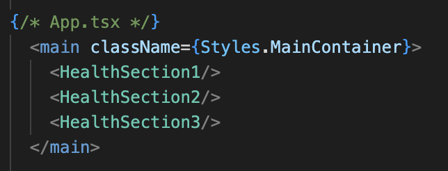
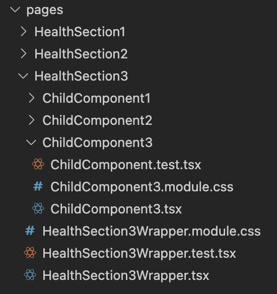
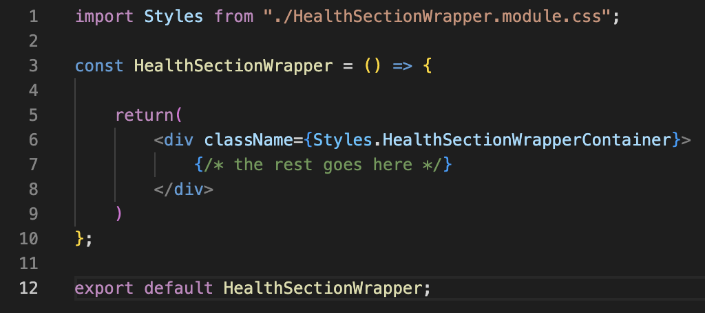

Live link: https://midnattlantern.github.io/adventist-uppsala-halsa/

The project Adventist Uppsala Hälsa (“AUH” for short) is a commission for Uppsala’s Adventist community, aiming to provide health-related advice and guidelines according to the Seventh-day Adventist values. The aim is to inform people about how they can improve their quality of life through habits and food/drinks.


Setting Up the Project in Your IDE:
===
1. Set up a local directory and clone the repository:
```zsh
git clone https://github.com/MidnattLantern/adventist-uppsala-halsa.git
```
2. Due to the directory structure of this project, you will need to run the following command _twice_ to navigate to where the `package.json` file is located:
```zsh
cd ./adventist-uppsala-halsa
cd ./adventist-uppsala-halsa
```
3. Install the dependencies:
```zsh
npm install
```
4. To start the application, run:
```zsh
npm start
```
Or, if you need to debug on a second device connected to the same network:
```zsh
npm start -- --host
```


Setting up React
===
AUH is built using the React framework with NPM and is written in TypeScript.
How to install:
- Run the installation script:
```zsh
npx create-react-app app-name --template typescript
```


Deployment
===
AUH is a static web project, so it’s supported by GitHub Pages. <br/>
How to deploy:
1. Install the necessary packages:
```zsh
npm install gh-pages --save-dev
```

2. Inside package.json, add a "homepage" field with a link to the destination.
```json
"homepage": "https://MidnattLantern.github.io/adventist-uppsala-halsa"
```

3. Inside package.json, under "scripts", add deploy and predeploy:
```json
"predeploy": "npm run build",
"deploy": "gh-pages -d build"
```

4. After adding and pushing to the GitHub repository, run the following command when the project is ready for public release:
```zsh
npm run deploy
```


Fonts and assets - Credits
===
- Montserrat: https://fonts.google.com/specimen/Montserrat/license
- Merriweather: https://fonts.google.com/specimen/Merriweather/license?query=Merriweather
- Organization logo: https://www.adventist.design/downloads/logo/
- Stock photos: unsplash.com https://unsplash.com/license 
- Favicon and general assets: Alma Isaksson


Fonts, assets, colors - How to use
===

Fonts:
---
The fonts are imported in index.html inside the public directory. The snippet looks like the following:
```html
    <link rel="preconnect" href="https://fonts.googleapis.com">
    <link rel="preconnect" href="https://fonts.gstatic.com" crossorigin>
    <link href="https://fonts.googleapis.com/css2?family=Merriweather:ital,opsz,wght@0,18..144,300..900;1,18..144,300..900&family=Montserrat:ital,wght@0,100..900;1,100..900&display=swap" rel="stylesheet">
```
For this project, all variables, such as fonts, are located in the index.css file. Should you want to organize them in a separate file (i.e variables.css), make sure to make an import at index.css. Example:
```css
@import './directory-to-variables/variables.css';
```
Respective fonts can be used as usual in CSS files, but there are CSS variable from variables.css inside the styles directory `--font-theme-primary` for Merriweather and `--font-theme-secondary` for Montserrat. Example:
```css
.Text1 {
    font-family: var(--font-theme-primary)
}
.Text2 {
    font-family: var(--font-theme-secondary)
}
```

Colors:
---
All the colors used across the project are established as a variable inside index.css because the naming makes for good self-documentation. It is encouraged to use for instance `color: var(--color-theme-primary)` rather than `color: #3B7B88`.

Icons (Assets):
---
- All the SVG icons are stored inside the vector-icons directory.
- There is no strict naming convention for the folders/ directories. @MidnattLantern use kebab-case.
- Notes about setting up and importing SVG:
1. This is a CRA project, SVGR is built in. Type `import { ReactComponent as (YourIconComponentName) } from "../../assets/vector-icons/some-vector-icon.svg";` replace "YourIconComponentName" and "some-vector-icon.svg" with actual names. 
2. The directory cannot be named just "icons", that's why the directory is named "vector-icons". 
3. Unlike Vite, CRA cannot handle certain XML elements. It may be necessary to clean up XML imports on each SVG file manually by opening it up as text and delete the following XML attributes: `xmlns="http://www.w3.org/2000/svg" xmlns:xlink="http://www.w3.org/1999/xlink" xml:space="preserve" xmlns:serif="http://www.serif.com/"`.
4. Make sure the SVG file itself does not have any style attributes. Styles such as fill are established in a CSS file.

Images
---
- This project avoids non-english characters for compatibility reasons. Å Ä and Ö are replaced with A and O. Meaning images for purposes such as "återhämtning" will be called "aterhamtning" across the directories and files.


Pages:
===
- Pages are typically used inside <main> in App.tsx see image:

- Each major health section, such as "8 hälsonycklar", recipes, and general health advice, have their each "page" inside the "pages" directory.
- Each page contains a wrapper TSX file, with a correpsonding CSS and Test file. The wrapper TSX is a parent for child components, located as folders/ directories at the same level as the CSS and test file. See image:

- Seperating each major health section as pages enable the project to be flexible with how it wants to display, it could be a collapsable section or its different page. Note however because this is a static React project, it cannot use routing to display pages.
- Each TSX file, parent and child has a <div> wrapper like: <div className={Styles.(Name)Container}> replace "Name" with the actual name. See image:

- There is no strict naming convention for the folders/ directories. @MidnattLantern use PascalCase.

EightHealthKeys
---
- Each point is presented as a card, designed primarily for phone viewing and scaled up for desktop. The height uses `vh` units to ensure each card fits within any device screen.
- Each health key card includes a title, a Expand button, a photograph, and a photographer credit link. When Expandd, the image is covered by text.
- Expanding a health key should feel smooth and not disrupt the user experience. To achieve this, the content is placed inside a scrollable `<div>` with a fixed `vh` height, bordered by "bezel areas"—similar to the design of pre-iPhone X models. This means the content scrolls within its own window, while users can also scroll the entire page by touching the top or bottom bezel areas if they wish to move on without having to finish the entire health key paragraph.
- The purpose of hiding the text inside an expand button serves two purposes:
	1.	Optimizing the limited real estate of a phone while keeping the app feel fast to interact with.
	2.	Keeping the reader hooked once they click the expand button, as it’s easy to scroll past text that’s already in front of you, but when you make the effort to click the expand button, scrolling past would feel like wasted effort.
- This follows a similar philosophy to how Apple Stores adjust MacBooks at an awkward angle on purpose—since the guest is unlikely to adjust a MacBook and immediately walk away.
- Each health key card has two different components specific to the viewport width. Because the layout and element structure are very different depending on the viewport, it was easier to split them into two. Combining the two into one unified component is done in the wrapper parent, which also tracks the viewport.

Responsiveness
===
- The project is designed with a mobile-first approach. CSS files use three @media queries to adjust for larger screens by detecting min-width.
1. Small: default
2. Medium: @media (min-width: 480px)
3. Large: @media (min-width: 768px)
4. X-Large: @media (min-width: 1280px)


Search engine
===
- The search engine is entirely run on client-end. It is run by Fuse.js.
- Any content that can be found trough Fuse.js are stored as .json files under teh content directory.


App.tsx
===
- Regarding responsiveness, App.tsx determines the dimensions of the header, main and footer. Each respective component has no size limit and are restricted by App.tsx


Components (global)
===
- Not to be confused with local components that may exist in a pages directory.
- Inside the components directory, there are folders/ directories for each component. They come with a JSX file (written in TypeScript), a module.css file and a test file. Each component are wrapped in a ComponentContainer div element.
- There is no strict naming convention for the folders/ directories. @MidnattLantern use PascalCase.

Header
---
- Logo: Appearing at the top right of the page, displaying the logo of the organization. Pressing the logo will take the user to the organization's main website.
- Search bar: Appearing fixed at the bottom right for phone, and at the header for desktop, the search bar allows the user to find specific information conveniently. It's automatically Expands in phone view when not used to save space, but always expanded on desktop.

ClickableImage
---
- Since the project is designed with a mobile-first approach, ClickableImage is intended to take full advantage of the limited screen real estate by making any image interactive.
- This component is a custom element that requires an image link (src), and optionally accepts button text and an onClick behavior. Its width and height are flexible within the boundaries of its parent container.
- The button text is always visible on smaller screens, but remains hidden on larger screens unless the user hovers. While it is fully functional across all screen sizes for consistency, it is recommended to place buttons outside the image on larger screens when space permits.


Contexts
===

Viewport context
---
- The viewport context enable an easier way to use viewport dimensions such as width for JSX logic. The context provider is wrapped around the <App /> inside index.tsx
- To use in a JSX/ TSX file, with width as an example, import: `import { useViewPortContext } from "./relative-path/contexts/useViewportContext";` then `const { viewportWidth } = useViewPortContext();` inside a const and retrieve the wievport width with `viewportWidth` as a number.


Manual Testing
===
The project was manually tested using an iPhone 13 mini and a web browser on a MacBook 13 inch.


Unit Testing
===
Each JSX file (aside from index.tsx) has a respective test.tsx file using Jest.


Other
===
Readme image:


force rename files for unix (Linux, MacOS):
mv oldName newName

There is no search functionality yet, a fututre iteration of fuse.js is likely to happen
https://www.fusejs.io/
